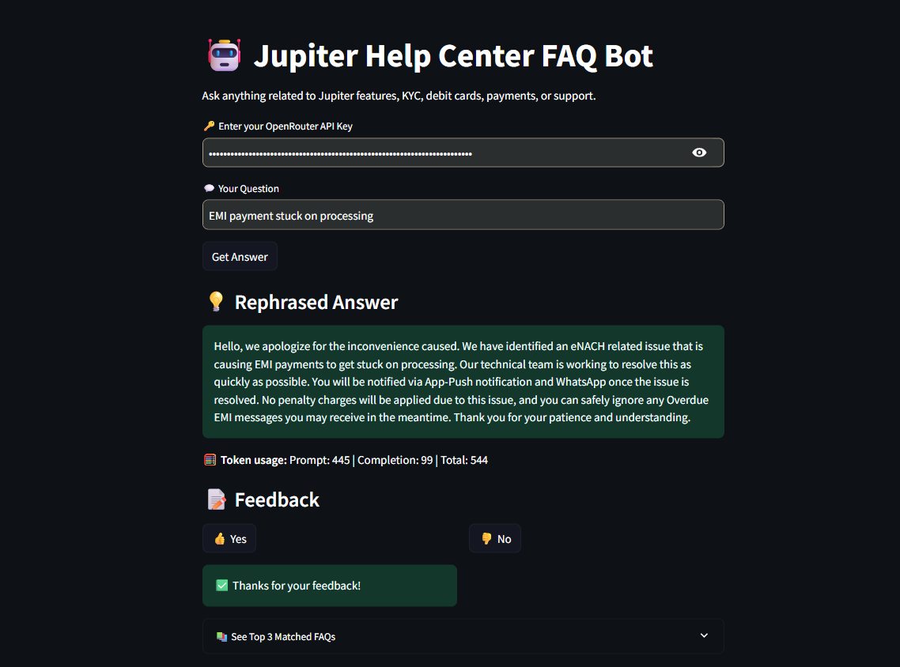

🚀 Jupiter Help Center FAQ Bot

🤖 Built as a real-world LLM application for Jupiter’s AI Internship Challenge

This project simulates a smart, multilingual chatbot for Jupiter's customer support that can understand natural questions, fetch the most relevant FAQs from the help portal, and rephrase them professionally using an LLM — all within a clean Streamlit app.

🧠 What It Does

✅ Takes any customer query — English, Hindi, or Hinglish✅ Searches Jupiter’s scraped FAQs using semantic search (not keywords)✅ Picks the most relevant answers using embeddings (FAISS)✅ Rewrites the answer with a clear, friendly tone using Mistral 3.2 LLM✅ Shows token usage and lets the user give feedback (👍 / 👎 + comments)

🎯 Key Features

Feature

Description

🔍 Semantic FAQ Retrieval

Uses MiniLM + FAISS for fast, smart FAQ matching

✍️ LLM-Based Rephrasing

Uses mistralai/mistral-small-3.2-24b-instruct via OpenRouter

🌐 Hindi + Hinglish Support

Auto-translates input using langdetect + googletrans

📊 Token Usage Display

Tracks prompt, completion & total tokens per OpenRouter call

📩 Feedback System

Lets user submit reaction and comment for each answer

🧾 Clean Streamlit UI

Simple, polished frontend with expand/collapse for top 3 FAQs

🖼️ Demo Screenshot

🧪 Test This Bot With Queries Like:

🔹 My KYC is pending

🔹 payment deducted but not received

🔹 card otp nahi aaya (Hinglish)

🔹 पैसे कट गए लेकिन ट्रांजेक्शन नहीं दिख रहा (Hindi)

⚙️ Run This Project Locally

git clone https://github.com/yourusername/jupiter-faq-bot.git
cd jupiter-faq-bot
pip install -r requirements.txt
streamlit run app.py

✅ You’ll need a free OpenRouter API key → https://openrouter.ai

🗂️ Project Structure

├── app.py                      # Main Streamlit frontend
├── rephrase_with_mistral.py   # Sends prompt to Mistral LLM via OpenRouter
├── semantic_search.py         # Embedding + FAISS similarity logic
├── cleaned_faqs.json          # Pre-cleaned FAQ knowledge base
├── feedback_log.csv           # User feedback storage
├── requirements.txt           # Python deps
└── README.md                  # This file

🛠️ Built With

Python 3.10+

Streamlit – for UI

FAISS – for vector similarity search

Sentence Transformers – for query/FAQ embeddings

Mistral via OpenRouter – for response rewriting

Langdetect + Googletrans – for multilingual input support

🌐 Optional Deployment

Deploy this to:

Streamlit Cloud — One-click GitHub connect

Hugging Face Spaces — (also supports Streamlit apps)

👋 About Me

Your NameAI + Data Science Enthusiast | Internship Applicant @ Jupiter

📫 Let's connect: yourname@email.com
